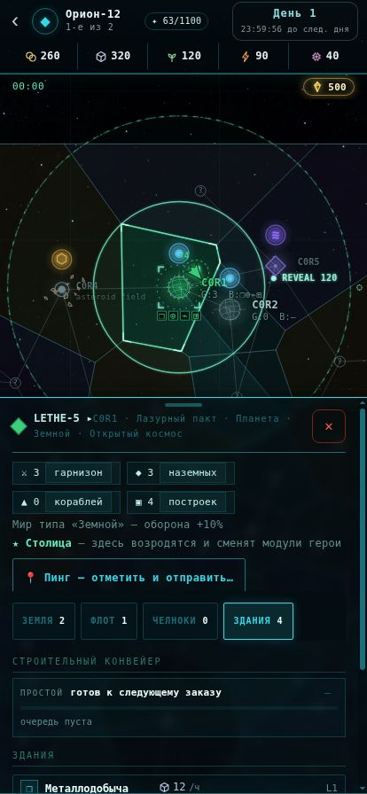
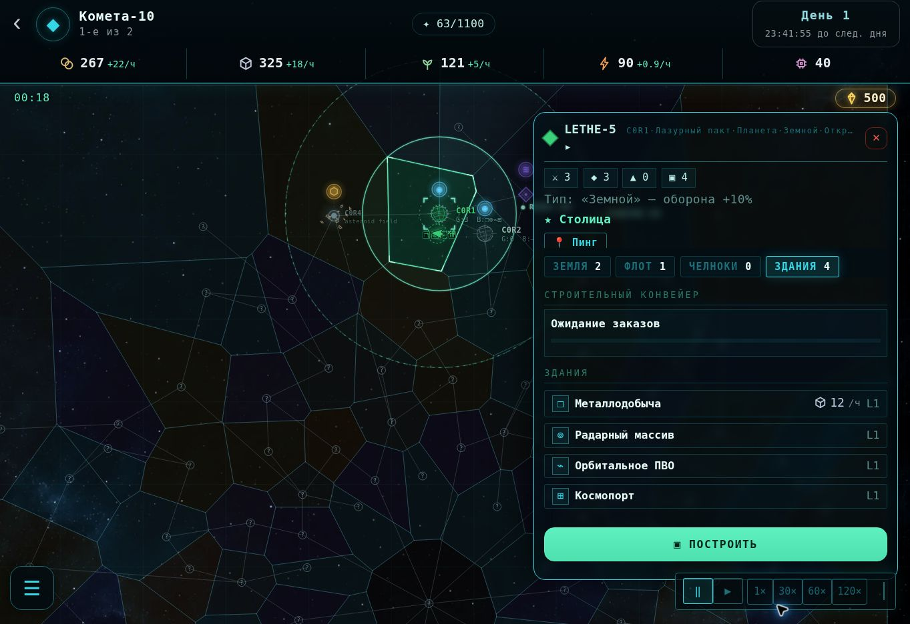

# Голографическая карта — проверка оформления

Статус: **пройдено в браузере** для обновлённого отображения карты и выбора провинции.
Нативная проверка APK на устройстве не выполнялась.

## Визуальный ориентир и границы изменения

Выбранный пользователем образ — тёмный космос, прозрачная векторная проекция,
тонкие границы, каркасные сферы и хорошо различимое выделение. Референс и реальные
снимки просмотрены вместе. По последнему уточнению пользователя геометрия карты,
размеры провинций, связи и маршруты сохранены. Фон темнее концепта; текущие цвета
отношений и пользовательская палитра сохранены. Рабочие панели и размеры кнопок
остаются игровыми: карта на концепте без открытого досье, на снимках ниже — с ним.

## Результат

- Проверены 414×896, 834×1112 и 1363×936. Телефон и планшет — размеры iframe в
  обычном браузере, без эмуляции Android или подтверждения нативного touch/pinch.
- Соло-матч запускается через существующие экраны. Тап внутри C0R1, вдали от узла,
  открывает досье и выделяет настоящий полигон. Панель закрывается штатной кнопкой.
- Неисследованная C1R11 выбирается, но показывает «НЕТ ТЕЛЕМЕТРИИ»; чужие данные и
  радарные постройки не появляются. Сигналы и их правила видимости не менялись.
- Pan и wheel zoom работают; границы, заливки и выделение используют одни полигоны.
  Контакты, подписи и маршруты рисуются выше подсветки.
- Дополнительно проверены выбор эскадрильи внутри провинции, назначение курса к
  C0R2 и отмена движения: площадь провинции не перехватывает эти команды.
- Код расчёта power diagram побайтово совпадает с `main` (`ae652ab7`).
- Вращение видно между кадрами; его часы отделены от скорости симуляции. Остановка
  этих часов на паузе/при reduced motion проверена по коду. Существующие импульсы
  радара продолжают жить независимо от игровой паузы — полной заморозки картинки нет.
- Ошибок от игрового URL в проверенных логах браузера не обнаружено. Служебные
  сообщения расширения браузера отделены от ошибок приложения.

### Телефон

### Компьютер

## Сборка и ограничения проверки

- `pnpm run check`: lint, typecheck, тесты и docs-check зелёные. Актуальный счётчик
  тестов указан в [docs/state.md](docs/state.md).
- Собраны dev/player/admin HTML и Vite-клиент. WebP включён в автономные HTML как
  data URL, внешняя загрузка текстуры для APK не требуется.
- `prototype/perf.mjs`: контрольный прогон без параллельного гейта дал CPU p95
  idle 1.42 мс, pan 4.50 мс, zoom 5.76 мс. Строгий бюджет пройден. Прогон базовой версии тем же harness:
  13.42 / 7.24 / 12.59 мс. Это одиночные замеры с шумом, Canvas-вызовы заглушены;
  они не измеряют GPU, FPS телефона или выигрыш на устройстве.
- При повторной проверке восстановлен `prototype/uitest.mjs`: актуализированы
  fake DOM, Path2D и performance; прежний неработающий synthetic click заменён
  настоящими зарегистрированными обработчиками pointerdown/pointerup с проверкой
  их наличия. Прогон проходит: 60 кадров, ввод на карте и событие панели без исключений.
