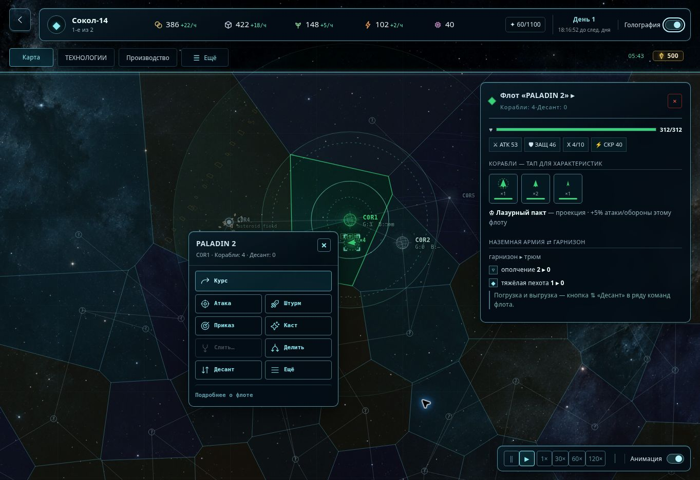
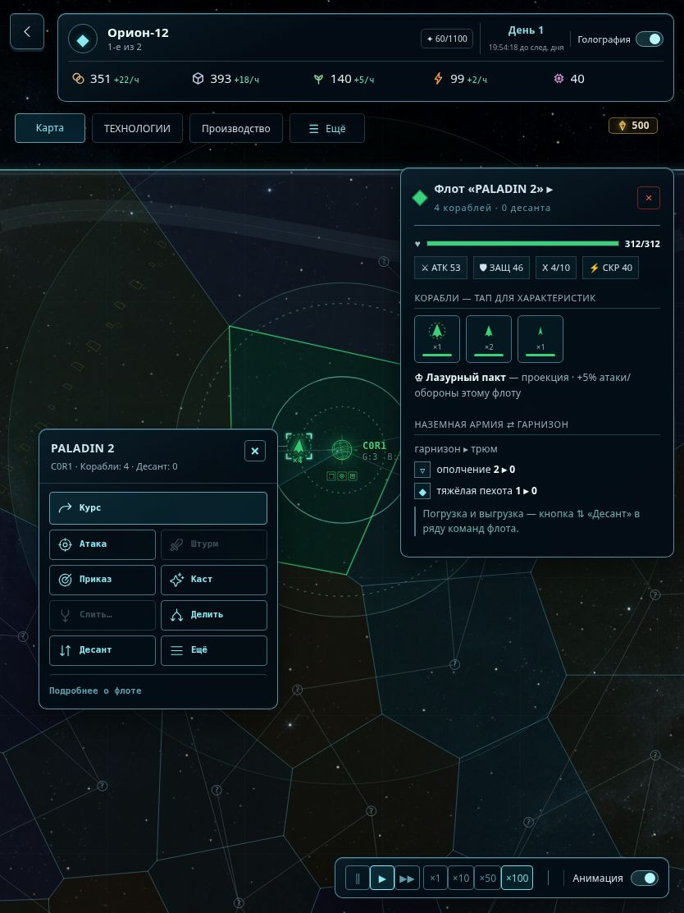
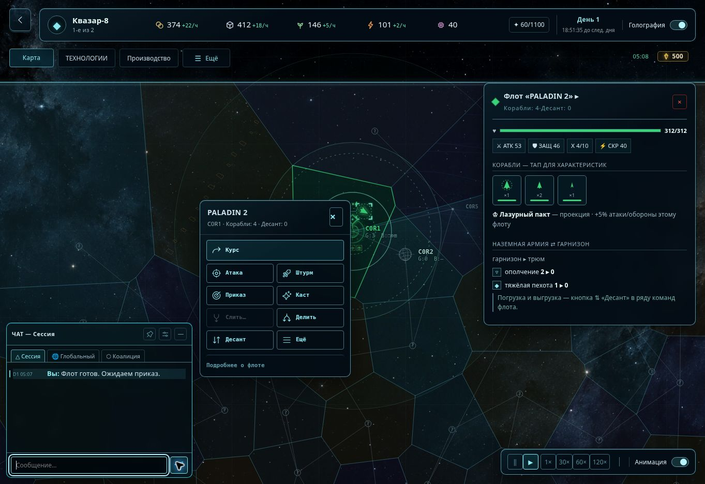
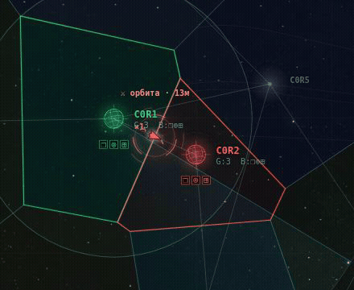
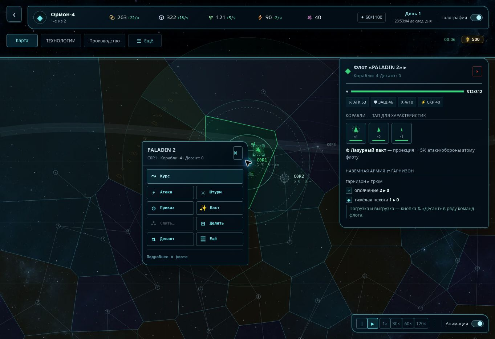
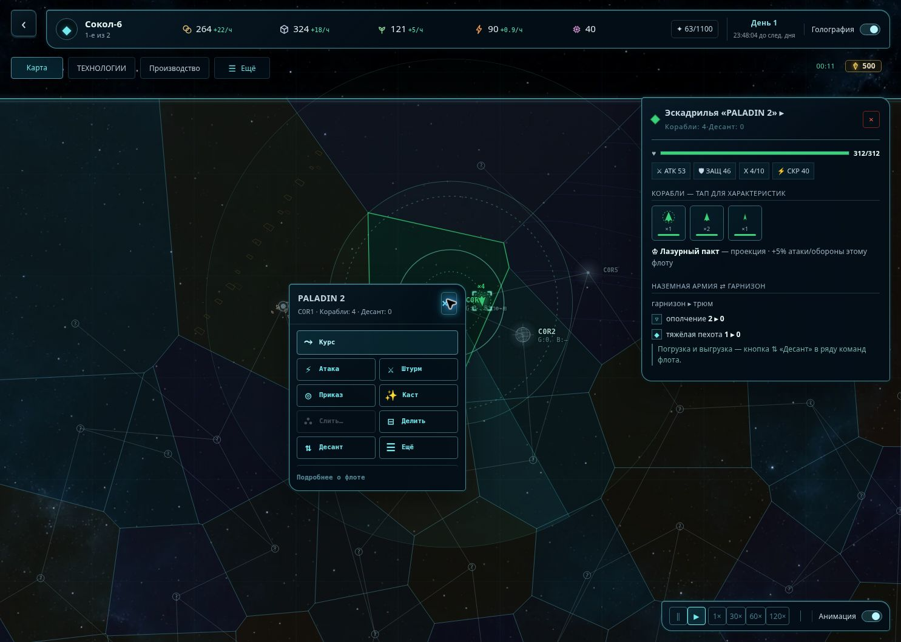
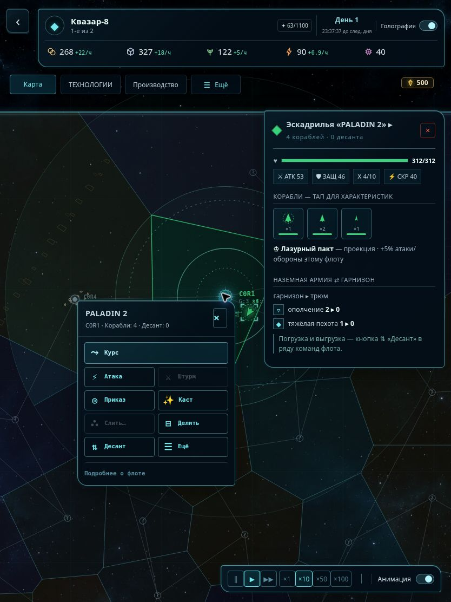
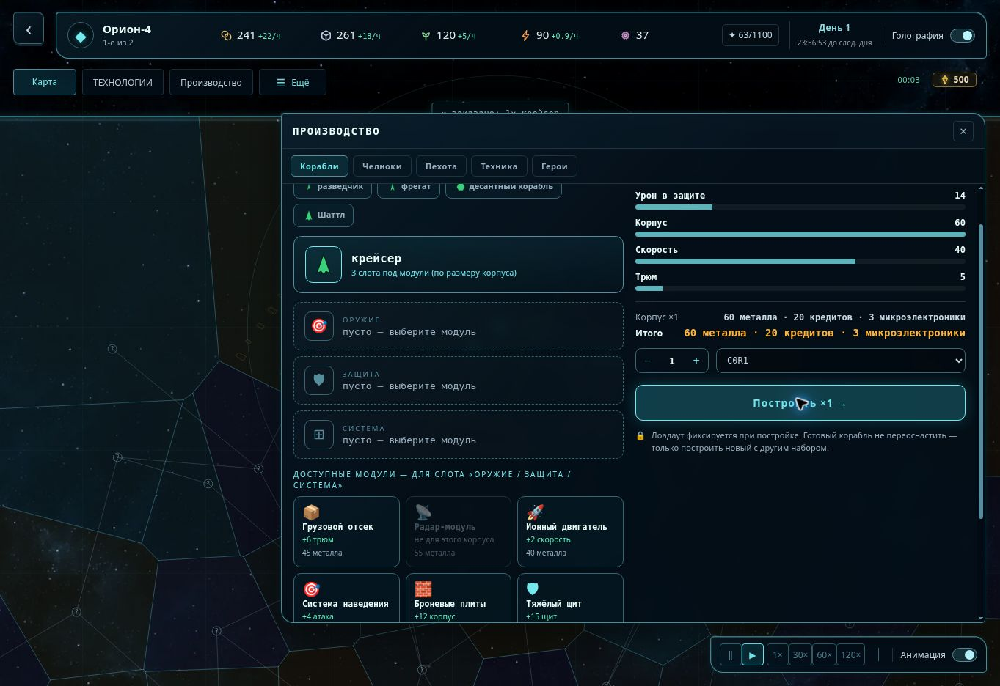
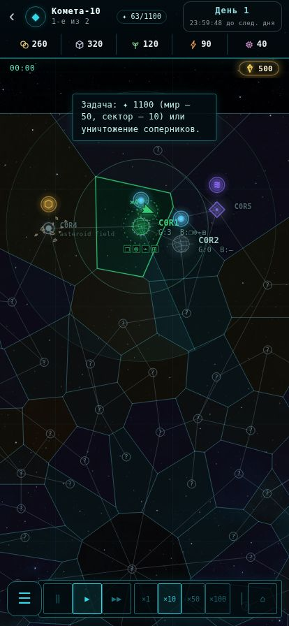

# Флагманская консоль — проверка оформления

Статус на 12 сентября: **кандидат на свежем `main` прошёл полный гейт и
проверку запуска в Chromium на ПК 1440×960**. Новая холодная волна и оболочка
меню описаны ниже. Предыдущая браузерная проверка ПК, планшета и телефона
и снимки — 10 сентября 2026, база `ff5f9560`.
11 сентября ветка совмещена с `35f2a51a` (включая PR #968): сохранены эскадрильи
вместо старых крыльев флота, актуальные команды и перенос общих решений в
`/decisions`. На этой базе повторно прошли полный гейт, сборка dev/player/admin,
UI smoke и браузерная проверка ПК: соло-запуск, выбор провинции, вкладки флота и
эскадры, ангар и конвейер челноков, дополнительные команды, переключение оформления
с сохранением выбора. Нативные APK и физический планшет не проверялись; это не
сертификация всех игровых механик или новых многосторонних боёв.

Перед передачей PR база обновлена до `9588dc21` (SEC-37, PR #969). Изменения
браузерного smoke и его CI-аннотаций сохранены. После этого реализован выбранный
пользователем вариант полировки и эффекты, перечисленные ниже.

## Холодный перелив и оболочка меню — 12 сентября

На базе `3a8f7037` добавлены бирюзово-сине-фиолетовые переливы с мягкими краями,
тонкими каустиками и скользящим жемчужным бликом. Золотистых цветов в палитре
волны нет. Отражение обрезается скруглённой рамой мира и рисуется под игровыми
объектами. Используется существующий визуальный таймер; настройка свечения
убирает широкое сияние. Покадрового Canvas blur нет.

`prototype/bridge-shell.css` оформляет существующие вход, регистрацию, главное
меню, подготовку партии и результаты. Обработчики серверного входа не изменены.
Специальный режим автономного предпросмотра в кандидат PR не включён.

Проверено на кандидате: полный `pnpm run check` — 444 файла тестов прошли,
1 пропущен; 5892 теста прошли, 70 пропущены без базы данных. Сборка dev/player/admin
успешна. В настоящем Chromium 1440×960 пройден путь «Новый командир → меню →
одиночная игра → совет учёных → старт → карта». Верхние ресурсы, отдельная кнопка
назад и холодная волна отрисованы; ошибок консоли и необработанных исключений нет.
Стандартный MCP smoke в этом окружении не смог запустить свой браузер, поэтому
проверка выполнена напрямую через Playwright с доступным Chromium.

## Дополнительная полировка — 12 сентября

База обновлена до `3a8f7037` (PR #970): перенос построителей приказов в `/decisions`
сохранён. Ядро, сервер, игровые данные и построители приказов совпадают с этой базой.

- Переключатели оформления и движения оставлены только в существующих настройках.
  Они доступны в матче через «Ещё» и сохраняют прежние значения предпочтений.
- Контраст вспомогательных подписей и активных команд повышен. Короткое появление
  устойчивых контейнеров через прозрачность не сдвигает цели нажатия. На планшетах
  основные элементы управления получили области нажатия 44 px.
- В туманностях и солнечных вспышках добавлен объём; статические градиенты запекаются
  вместе с картой. Живых фигур не стало больше. Камни и обломки различаются формой.
- Выключенное движение отменяет новые анимации панелей; выключенное свечение также
  убирает CSS backdrop blur. Мобильная переработка отложена, старый режим сохранён.

Проверено: `pnpm run check`, сборка dev/player/admin, разбор CSS без предупреждений,
UI smoke и строгий CPU-бюджет. В happy-dom с настоящими обработчиками игры проверены
1440×960, 834×1112 и 414×896: соло-запуск, ресурсы, технологии и производство,
закрытие через Escape, настройки движения/оформления, зум, выбор флота, реальный
приказ движения и возврат в меню. Переключение настроек и окон не меняет снимок
игрового состояния; масштаб сохраняется с погрешностью float, камера продолжает
подчиняться существующему ограничению края мира.

Ограничение: браузер среды запретил открытие локального `file://` URL. Эти проверки
не подтверждают фактическую вёрстку, GPU/FPS или физический touch. Скриншоты ниже
относятся к прежним проверкам 10–11 сентября и не показывают правки от 12 сентября.
Публичного развёртывания в этой работе не выполнялось.

## Полировка и сигналы — 11 сентября

Выбранный [визуальный ориентир](docs/previews/holographic-polish-reference.png) и
[рабочий экран](docs/previews/holographic-polish-desktop.jpg) просмотрены в одном
сравнении: та же пропорция экрана и выбранный PALADIN 2, фактический viewport
1363×936. Сохранены расположение ресурсов, большая карта, соседство команд с флотом
и полное досье. Исправлены толщина рамок, контраст, световые края, размер/центровка
кнопки закрытия; команды и инструменты получили одинаковые векторные иконки.

- Новый фон: создан ImageGen, 1536×1024, WebP 211 148 байт, без искусственного
  увеличения. Отдельно декодируется только выбранное оформление; вписан без
  растяжения и встроен в HTML. Простой режим использует свой прежний фон.
- 31 официальный SVG Phosphor regular: закреплённый исходный commit и MIT-лицензия
  лежат в `prototype/src/art/phosphor/`; новых исполняемых зависимостей нет.
- Пинг создан через настоящее окно провинции и отправлен в локальную коалицию.
  Маяк сохраняет цвет владельца и исходную точку клика; пользовательские скрытие,
  адресация и серверные сообщения не менялись.
- В штатном dev-сценарии столкновения запущены два настоящих орбитальных боя.
  Коралловые дуги показаны у столкновения на трассе, таймер читает `nextRoundAt`.
  [GIF](docs/previews/holographic-battle.gif) — 3,6 секунды последовательных снимков
  участка реальной игры, с частотой захвата около 4 кадров/с; это не замер FPS игры.
  Янтарный эффект наземной фазы реализован, отдельный наземный бой в браузере не разыгрывался.
- В локальном чате отправлено сообщение: у новой строки действительно включается
  `holo-transmission`. После отключения анимации класс `holo-still` установлен, а
  вычисленное имя анимации — `none`. Отправка в сеть/другим людям не выполнялась.
  Пять тестов проверяют дозапись, замену истории, ограниченный журнал, отсутствие
  анимации истории при открытии и очистку эффекта после завершения/отмены.
  Старый акцент удаляется, чтобы переключение оформления не проигрывало его повторно.
  В браузере проверен переход числа `.cw-arrival` с 1 до 0 после 1,8 секунды.

На свежей сборке также проверен планшет 834×1112: вход в соло, вкладка флота,
реальный выбор PALADIN 2 и размещение команды рядом с флотом без перекрытия досье.

## Источник и сравнение

[Согласованный пример](docs/previews/holographic-reference.png) и
[реальный экран](docs/previews/holographic-desktop.jpg) просмотрены вместе одним
сравнением при 1485×1059. Отдельно оценены верхняя панель, рамка карты, досье и
команды: размеры, отступы, шрифты, контраст, края, реальные подписи и иконки.

Сохранено направление: тёмный космос, тонкая стеклянная проекция, независимая
панель ресурсов, окна поверх карты, команды рядом с выбранным флотом.
Позднейшие уточнения пользователя имеют приоритет над картинкой: маленькая
клавиша назад вынесена отдельно, бейджи типов заменены материалом местности.

Осознанные отличия от иллюстрации:

- Досье содержит действительные характеристики, гарнизон, конвейеры и действия.
  Выбор флота показывает его досье; одновременный вымышленный выбор провинции не добавлен.
- В командном окне весь существующий набор, включая новую «Атаку», а не три
  иллюстративные кнопки. Недоступные действия сохраняют реальные ограничения.
- Текст и значки происходят из локализации и игрового каталога. Нового растрового
  портрета планеты и вымышленных показателей населения нет.
- Используется встроенная игровая текстура тёмного космоса. Геометрия, масштаб
  объектов, цвета владельцев и маршруты сохранены; камера на снимке у верхнего
  края мира, поэтому именно там видна рама. Это не рамка по краям окна браузера.
- По уточнению от 11 сентября консоль скрывает внутренние линии между провинциями
  одного владельца. Классификация границ и полигоны прежние: внешние фронтиры,
  нейтральные линии и подсветка выбранной провинции остаются. Старые снимки ниже
  сделаны до этого уточнения.

Исправлены при сравнении: слабый стеклянный край; наложение «Ещё» на обновлённое
название «Производство»; слишком широкое досье вертикального планшета; наложение
тумблера простого режима на командный ряд; размеры тумблера анимации под coarse
pointer; пустой префикс местоположения летящего флота. Открытых P0/P1/P2 в
проверенных состояниях не осталось. Дальнейшая художественная настройка — с владельцем.

## Проверенные сценарии

| Поверхность | Проверка и результат |
| --- | --- |
| ПК 1485×1059 и 1363×936 | Соло-запуск, выбор площади провинции, вкладка флота, окно команд у маркера, досье справа. Ресурсы и навигация помещаются. |
| Планшет 834×1112 | Ресурсы в двух рядах, отдельная клавиша, полное досье и команды рядом с флотом. Нет горизонтального переполнения верхнего окна. |
| Телефон 414×896 | Прежняя раскладка и парящие бейджи. Новая оболочка и её тумблер скрыты. |
| Приказы | Курс к C0R4 начал настоящее движение; «Стоп» оставил флот на трассе C0R1–C0R4. Выбор оформления сохранил флот и команды. |
| Производство | Все пять вкладок открываются. Заказ крейсера списал ресурсы и появился в конвейере кораблей. |
| Закрытие слоёв | Escape закрывает производство. Отдельная клавиша назад сначала закрыла подсказку первого входа, затем само окно, сохранив матч. |
| Графика | Переключение простого/голографического режима кнопкой и клавиатурой; сохранение настройки при перезагрузке. Тумблер анимации использует существующую настройку движения. |
| Туман и сигналы | Материал строится только для известной или запомненной провинции. Неизвестный сектор при осмотре не раскрывает телеметрию. Обработчик радарных контактов не зависит от декоративной волны. |

Дополнительно в ходе работы проверены исследование с расходом ресурсов,
раскрытие дополнительных команд и pan/zoom. Их правила в итоговом diff не менялись.
В проверенных логах нет ошибок игрового URL; сообщения расширения браузера
`chrome-extension://` относятся к среде проверки.

## Снимки

Ниже — сравнение раскладок от 10 сентября:

## Автоматические проверки и границы

- `pnpm run check`: lint, typecheck, тесты и docs-check зелёные. Актуальный
  счётчик — в [docs/state.md](docs/state.md); durable-тестам и учению бэкапов нужна
  `DATABASE_URL`.
- 21 новый тест: пять проверок прихода сообщений и 16 проверок оболочки — размещение у маркера и краёв, обход досье, маленькая высота,
  сохранение проекции при смене оформления, граница телефона/планшета, защита
  неизвестной местности и исходного полигона.
- `prototype/uitest.mjs`: 60 кадров и ввод без исключений. Fake DOM дополнен
  измерением окон и CSS-свойствами; это smoke-проверка, не эмуляция браузера.
- `PERF_STRICT=1 node prototype/perf.mjs` (10 сентября): CPU p95 idle 0.97 мс, pan 3.74 мс,
  zoom 4.04 мс. Canvas-вызовы заглушены: замер не оценивает GPU, FPS телефона или батарею.
- Dev/player/admin HTML собраны. Новых зависимостей, сетевой загрузки графики,
  изменений симуляции, карты, игровых данных или серверных приказов нет.
- Планшет/телефон проверены через iframe заданного размера, без аппаратного touch.
  Ландшафт телефона, широкая ориентация планшета и низкое окно ПК покрыты тестами
  геометрии; нативные жесты и длительная сетевая партия требуют проверки на устройствах.
