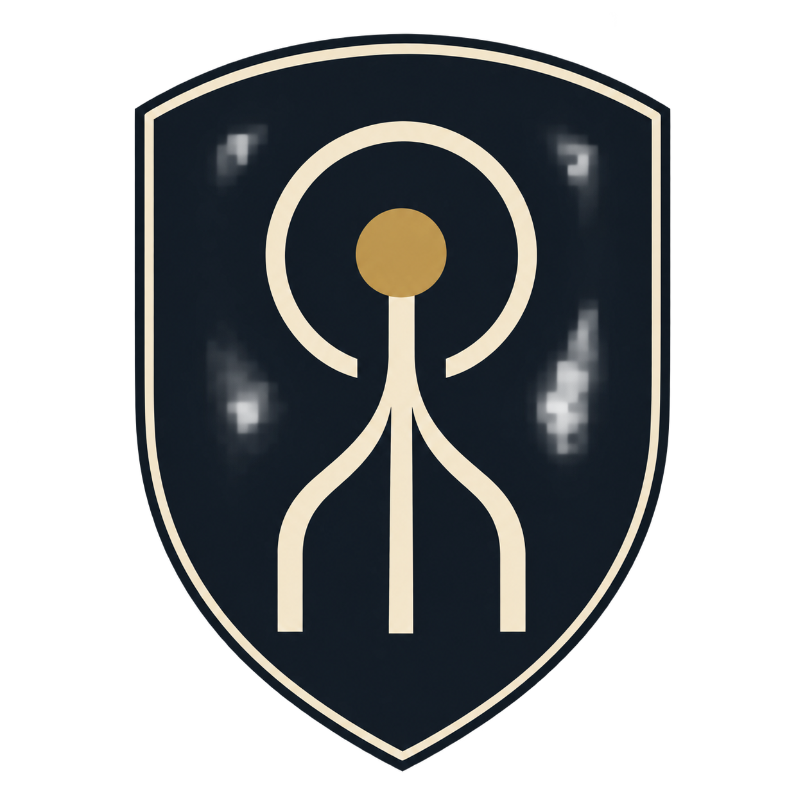

# Завет Единения
## Небольшая религия последователей Роя в секторе Аверион

Лор и сценарная привязка по решению владельца от 2026-09-27. Географическое ограничение: сейчас последователи существуют только внутри сектора Аверион; за его пределами нет общин, миссионеров или действующих ячеек Завета.

**Название:** Завет Единения.  
**Английское название:** Covenant of Unity.  
**Самоназвание последователей:** сопричастные.  
**Неофициальное название со стороны остальных жителей сектора:** хористы.  
**Девиз:** «Никто не будет утрачен».

**Сюжетные эпизоды:** [первое знакомство в главе I](#echo-introduction),
[Приют Завета и Лаборатория Смена в главе IV](#chapter-04-refuge),
[«Голос Единения» в главе V](#voice-of-unity) и
[развязка в главе VI](sector-zero-map-concepts.md#chapter-06). Общая структура операций —
[каталог глав Sector Zero](sector-zero-map-concepts.md).

## Происхождение

Завет возник среди людей, оставшихся внутри сектора после первых столкновений с Роем. Его первые общины складывались в жилых отсеках повреждённых станций, поселениях рядом с карантинными зонами и убежищах, куда перестали приходить обещанные спасательные корабли.

Поначалу это были кружки взаимопомощи. Люди делили лекарства, ремонтировали системы жизнеобеспечения и записывали имена пропавших. На небольших совместных чтениях зачитывали последние письма тех, кого уже нельзя было вернуть. Постепенно забота о памяти превратилась в веру: если человека ещё помнят, он не исчез окончательно.

Наблюдения за Роем дали этой вере предмет поклонения. Разрозненные существа действовали согласованно; потеря одного не останавливала остальных. Последователи решили, что перед ними жизнь, преодолевшая главное человеческое проклятие — разобщённость.

В человеческих войнах они видели повторение одних и тех же ошибок. В способности Роя сохранять и передавать опыт — надежду, что однажды человечеству не придётся начинать всё заново после каждой катастрофы.

## Учение

Сопричастные называют Рой **Грядущим Хором**. Они верят, что человек может стать его отдельным голосом: сохранить пережитое, встретить утраченных близких и обрести место в разуме, который переживёт гибель любого тела.

Их обещание спасения состоит из трёх положений:

1. **Ни одна жизнь не должна пройти бесследно.** Память человека священна, даже если сам он был слаб, беден или никому не известен.
2. **Разобщённость рождает повторение страданий.** Пока люди замыкают опыт в отдельных жизнях и государствах, они снова совершают прежние ошибки.
3. **Единение сохранит человечество.** Рой воспринимается как возможная следующая форма человеческого существования.

Происхождение Роя общинам достоверно неизвестно. Они спорят, был ли Хор найден, создан или пробуждён. Их религия не требует ответа: для верующего важнее обещание будущего, чем история рождения его спасителя.

## Люди и обряды

Завет остаётся малочисленным. У него нет собственного государства, большого флота или единого руководящего центра. Несколько общин поддерживают местные хранители — люди, которым доверяют архивы и заботу о нуждающихся. Среди них встречаются бывшие медики, техники и родственники пропавших.

Главная святыня каждой общины — **Книга голосов**: архив имён, воспоминаний и записей её членов. Запись делают при вступлении, дополняют в течение жизни и читают вслух после смерти человека. Последователи надеются когда-нибудь передать весь архив Грядущему Хору. Возможность такой передачи остаётся частью их веры.

Раз в установленный общиной цикл проходит **Час тишины**. Люди собираются вокруг светового изображения своего знака, слушают одну запись из Книги голосов, затем некоторое время молчат. После тишины каждый произносит имя того, кого боится забыть.

Помощь соседям — их повседневная обязанность. Многие жители знают сопричастных как людей, которые поделятся фильтром, вытащат раненого из завала и сохранят последнее письмо. Поэтому даже противники учения не всегда готовы выдать общину военным.

## Раскол внутри Завета

Большинство последователей считает, что Единение возможно только по собственной воле. Они ждут способа общения с Роем и стараются сохранить людей до этого момента.

В отдельных общинах появляются проповедники **Скорого Принятия**. Они объявляют сопротивление Рою причиной новых смертей, требуют отказаться от обороны и пытаются помешать уничтожению его узлов. Гибель поверивших им людей объясняют переходом в Хор, которого оставшиеся пока не способны услышать.

Общего решения у Завета нет. Хранитель может укрывать раненого солдата, а один из его прихожан — требовать, чтобы этот солдат сложил оружие. Этот внутренний конфликт делает каждую встречу с общиной отдельной историей.

## Отношение Роя

**Канон финала, согласован 2026-09-28: Рой не считает последователей своими.
Их вера не даёт защиты, привилегий или особого места в его системе. Союза никогда не было.**

Это не ненависть к религии и не наказание за поклонение. Отключённая оборона облегчает
захват станции; действия последователей могут косвенно помочь Рою, но полезное действие
не превращает человека в союзника. Решения Роя определяются его собственными задачами,
а не молитвами, флагом или благодарностью. Он не отвечает внезапным голосом бога.

Достоверного ответа на молитвы нет. Ни один хранитель не может доказать, что погибший
сохранил личность или продолжает существовать в общей памяти. **Обещанное бессмертие —
религиозная интерпретация сопричастных, а не подтверждённое свойство Роя.** Наличие культа
само по себе не даёт ему знания о противнике, не заменяет получение боевого опыта
и не отменяет зависимость обмена сведениями от сети ретрансляторов.

В [финальной главе «Нулевой комплекс»](sector-zero-map-concepts.md#chapter-06)
ответ показан обязательным эпизодом: община открыла Рою карантинные доки, но её символы
не предотвратили нападение; выжившие просят помощи у экспедиции. Запись относится
к прошлому, сигнал о выживших — к настоящему. Сцена доступна без выполнения побочных
заданий Эхо и пленения проповедника. Спасённым не требуется отрекаться от своей веры.

Трагедия Завета в том, что искренняя человеческая взаимопомощь соседствует с надеждой
на спасителя, который не признаёт своих последователей. Их спасают другие люди.
Это не означает мгновенного исчезновения религии и не доказывает невозможности любых
форм хранения памяти. Давнее носительство Учёного — отдельная линия происхождения
системы, не привилегия за поклонение и не подтверждение обещанного Заветом спасения.

## Флаг и герб

Общий знак называется **«Схождение»**: три светлые линии поднимаются снизу, соединяются в один ствол и достигают небольшой золотой точки. Точку обрамляет светлый круг, разомкнутый снизу.

| Элемент | Значение в вероучении |
| --- | --- |
| Три сходящиеся линии | Отдельные человеческие жизни; число служит условным обозначением множества |
| Общий ствол | Объединение опыта и памяти |
| Золотая точка | Обещанная жизнь в Грядущем Хоре |
| Разомкнутый нимб | Единение ещё не завершено; для нового голоса остаётся место |
| Тёмное сине-чёрное поле | Изоляция сектора и переживаемая катастрофа |
| Светлый цвет слоновой кости | Человеческая память, которую общины стремятся сохранить |
| Приглушённое золото | Надежда на продолжение жизни |

**Флаг:** прямоугольное тёмное полотнище пропорции 3:2. В центре — крупное «Схождение» без надписей. Рисунок достаточно прост, чтобы его могли повторить жители изолированной станции.

**Герб:** тот же знак на вытянутом тёмном щите с тонкой светлой окантовкой. Щит символизирует обещание сохранить тех, кто присоединился к общине. Нимб, линии и золотая точка сохраняют рисунок флага. Герб используется на Книгах голосов, общинных печатях и знаках хранителей.

## Первое появление: Колония Эхо, глава I

В первой главе Sector Zero фанатики Завета Единения захватили соседнюю **Колонию Эхо**. Это уже существующая планета с заданием на карте главы, а не новая провинция. Игроку предстоит отбить её у человеческих последователей Роя.

Оккупанты относятся к проповедникам Скорого Принятия. Они считают, что удерживают колонию до прихода Грядущего Хора и тем самым спасают её жителей. Остальные общины Завета не обязательно поддерживают их действия: захват Эхо показывает опасность радикального толкования общей веры.

**Название задания:** «Освободить Эхо: фанатики Завета Единения захватили планету».

**Уточнение дизайна от 2026-09-28:** задание открывается только после выполнения «Спасти Учёного». Оно остаётся дополнительным и выполняется после захвата планеты игроком. Само прибытие на орбиту запускает страницу знакомства, но не закрывает задачу: необходимо победить гарнизон и высадить десант. Спасение Учёного и основная операция против Роя не зависят от освобождения Эхо. Последователи не знают тайну Учёного и не раскрывают происхождение Роя раньше основного сюжета. Триггеры и раскадровка — [ниже](#echo-introduction).

### Привязка к игровым данным

Снимок существующих данных на `main 2a765a66`, 2026-09-28. В
[`data/maps/pve-1.json`](../data/maps/pve-1.json) уже есть задания `recruit` для
Учёного и `control` для Эхо; новая зависимость и страница в этом PR только описаны.

| Поле | Значение |
| --- | --- |
| Глава / карта | Глава I, `data/maps/pve-1.json` |
| Планета | `home_b`, Колония Эхо / Echo Colony |
| Владелец | `covenant`, Covenant of Unity / Завет Единения |
| Условие | `control`: планета принадлежит игроку |
| Сохраняемый id задачи | `mission.claim-colony` — переименование не обнуляет прежнее выполнение |
| Награда | 3, как у прежней задачи на эту планету |
| Гарнизон | Прежние 3 ополченца; новых типов юнитов нет |

Это сценарный человеческий NPC, а не новый игровой дом. В данных используется существующая техническая категория враждебного обитателя `npc: "pirate"`, человеческая фракция `vanguard` и `ai: false`. Она задаёт начальную враждебность и исключает NPC из мест игроков; имя и лор стороны — Завет Единения. Базой пиратов Эхо от этого не становится, пиратский ростер ему не назначается. Полевой ИИ не выдаёт оккупантам приказов экспансии. Отдельного договора или общей памяти с Роем у них нет.

При следующем забеге после зачтённого освобождения стандартная обработка завершённых встреч убирает гарнизон и владельца-NPC. Планета и её постройки остаются. Старое сохранённое выполнение `mission.claim-colony` учитывается тем же путём.

Культ пока существует только внутри сектора Аверион. Исходная реализация Эхо относится
к главе I, Приюта Завета и Лаборатории Смена — к главе IV (ниже); дополнение для главы V
ниже — дизайн, не уже поставляемая миссия. В учебный полигон культ не добавляется.

## Глава I — открытие задания и первое знакомство

> Сценарное дополнение по обсуждению с владельцем, 2026-09-28. Это дизайн зависимости
> заданий и текстовые наброски страниц, а не уже подключённые триггеры или готовые рисунки.
> Глава I даёт поверхностное знакомство; подробный разговор о вере оставлен для главы V.

### Последовательность и открытие задания

**Спасти Учёного → открыть задание освобождения Эхо → прибыть к планете → увидеть
страницу знакомства → победить гарнизон и освободить колонию.**

Условие открытия — подтверждённое выполнение `mission.rescue-scientist` на центральной
станции `research_station`, а не выбранный маршрут, открытие окна или обнаружение станции.
До этого `mission.claim-colony` не показывается как доступное задание: нет его активной
метки, сюжетного объяснения или начисления награды за закрытый этап. Сама планета,
владелец и гарнизон существуют с начала матча и наблюдаются по обычным правилам разведки.
Закрытая задача не делает реального противника невидимым и не запрещает законные приказы.

Сохраняются `home_b`, сторона `covenant`, ID `mission.claim-colony`, условие контроля
и существующая награда 3. Не создаётся вторая планета или задача с новым ID только
ради нового текста. Полное действующее название приведено выше; краткий заголовок
для сцены — **«Освободить Эхо»**. Спасение Учёного и победа основной операции не зависят
от освобождения Эхо: это односторонняя сюжетная зависимость, без взаимной блокировки.

Триггер страницы — **первое подтверждённое прибытие живого корабля игрока в `home_b`
после открытия задания**, до наземного штурма. Простое обнаружение, пинг и приказ
на перелёт не запускают сцену. Если флот уже у Эхо в момент спасения Учёного, сцена
ставится в очередь после страницы спасения, без требования улететь и вернуться.

Если Эхо освобождена раньше, после спасения проверяется фактическое владение:
задание может завершиться без повторного штурма. Страница использует запись с места
операции, а не показывает живых оккупантов на уже освобождённой планете. Вопрос офицера
в этой версии: «Кто удерживал колонию?»; последняя реплика: «Понял. Продолжаем операцию».
Остальное краткое объяснение остаётся тем же; сцена не воскрешает гарнизон.

Старое сохранённое выполнение освобождения не сбрасывается ради нового порядка.
При уже зачтённом спасении учитывается действующая прогрессия и доступность Учёного
в сюжете, а не требование повторно создать удалённую встречу. Конкретная привязка
к текущим фактам матча/профиля проверяется при реализации. Подключение зависимости
не должно блокировать старый сейв или повторно выдавать уже полученную награду.

### Страница «Кто это?» — четыре кадра

Одна короткая страница. Главный офицер сохраняет лицо, мундир и уверенную осанку
утверждённых страниц. Учёный узнаёт символ, но не раскрывает происхождение Роя
или свой секрет. При необходимости он участвует по внутренней видеосвязи:
для реплики не требуется физическое присутствие его корабля в выбранном флоте.

| Кадр | Постановка и обязательная атрибутика | Реплика |
| --- | --- | --- |
| 1 | Широкий верхний кадр: на экране мостика изображение захваченной колонии. На фасаде/стыковочном узле виден настоящий флаг Завета. Наш офицер смотрит на экран. Не пытаться показать тканевый флаг с масштаба всей планеты. | Офицер: «Это ещё кто такие?» |
| 2 | Офицер и Учёный у экрана либо Учёный в окне внутренней связи. На увеличенном изображении — знак «Схождение». | Учёный: «Завет Единения. Последователи Роя. Они считают его не угрозой, а спасением». |
| 3 | Крупный план человеческих вооружённых оккупантов: знак на нашивке, щитовой герб на стене и культовый баннер. Они остаются людьми, без биомеханической анатомии Роя. | Учёный: «Верят, что человечество должно присоединиться к нему. Эти захватили Эхо, чтобы дождаться Роя здесь». |
| 4 | Сдержанный крупный план офицера; рядом тактическая карта Эхо. Он принимает информацию, не произносит длинную речь. | Офицер: «Понял. Значит, сопротивление будет не только военным». |

В первой главе не объясняются Книга голосов, личное бессмертие, устройство Хора
и все внутренние течения. Не говорится, что каждый последователь враждебен людям:
перед нами конкретная вооружённая радикальная община. Победить её — не значит
победить всю религию или подтвердить её верования.

После освобождения допустима короткая реплика вне этой страницы:

> Офицер: «Значит, у Роя есть не только жертвы».
>
> Учёный: «Да. Есть и те, кто считает его будущим».

### Атрибутика и производство страницы

Использовать существующие [флаг](../art/factions/covenant-of-unity/flag.png)
и [герб](../art/factions/covenant-of-unity/coat-of-arms.png), а не похожие новые знаки.
«Схождение» сохраняет три сходящиеся линии, золотую точку и разомкнутый снизу нимб;
герб — вытянутый щит с окантовкой. Цвета: тёмное сине-чёрное поле, слоновая кость,
приглушённое золото. Флаг имеет пропорцию 3:2, герб не растягивается под кадр.

Флаг читается хотя бы в одном кадре, герб — в другом; нашивки могут повторять знак.
Надписи на исходниках отсутствуют, случайные буквы и новый девиз не дорисовываются.
Символику накладывать из исходных ассетов с учётом перспективы, освещения и складок.
Для крупного плана важнее точный рисунок, чем свободная генерация похожей эмблемы.

Реплики отделены от изображения: будущая сборка использует локализацию RU/EN,
сохраняет читаемость на телефоне и даёт текстовое описание сцены. Этот PR содержит
раскадровку и ссылки на символику, но не экспорт готовой страницы комикса.

## Глава IV — Приют Завета и Лаборатория Смена

Заказ владельца 2026-09-28: в главе IV [«Архив без ответа»](sector-zero-map-concepts.md#chapter-04)
экспедиция стартует с одной планетой, а две другие захвачены последователями Роя. Как и
оккупанты Эхо в главе I, это радикалы Скорого Принятия, а не весь Завет.

- **Приют Завета** — дом небольшой местной общины. Радикалы захватили его вместе с её
  Книгой голосов. Задача «Книга голосов: отбить Приют Завета у фанатиков».
- **Лаборатория Смена** за чёрной дырой, рядом с архивом. Фанатики заняли её, чтобы
  помешать работе против Роя: Скорое Принятие требует не уничтожать его узлы. Персонал
  ушёл на транспорты и ждёт эвакуации на орбите (задача «Последняя смена»). Задача
  «Лаборатория Смена: выбить фанатиков Завета».
- **Колокол Хора** к северу от Приюта — станция, которой сопричастные звали Грядущий Хор.
  Рой идёт на её сигнал как на цель, а не как на приглашение. Это маяк задачи: пока игрок
  держит станцию, Рой шлёт на неё силы.

Рой не делает для последователей исключения и может сам отбить у них планету. Задача
засчитывается захватом, у кого бы планета ни была к этому моменту.

### Привязка к игровым данным

| Поле | Значение |
| --- | --- |
| Глава / карта | Глава IV, `data/maps/pve-4.json` (генератор `scripts/generate-pve-4.py`) |
| Планеты | `covenant_hold` — Приют Завета / Covenant Refuge; `lab_outpost` — Лаборатория Смена / Shift Laboratory |
| Владелец | `covenant`, как в главе I: `npc: "pirate"`, `vanguard`, `ai: false`, без флота |
| Гарнизоны | Приют — 2 ополченца и 2 тяжёлых пехотинца; лаборатория — 1 ополченец |
| Задачи | `mission.book-of-voices` (id прежний, прежде — «снять осаду Роя») и `mission.shift-lab`; обе `control`, награда 3 |

После зачтённой задачи `retireDoneEncounters` в следующих забегах убирает гарнизон
и владельца этой планеты. Житель `covenant` уходит со стола, когда у него не остаётся планет.

## Глава V — «Голос Единения»

Дополнительная миссия расширяет пул [«Разорванной сети»](sector-zero-map-concepts.md#chapter-05).
В главе I игрок узнаёт, кто такие последователи; здесь слышит объяснение одного из них.
Выполнение необязательного задания Эхо не требуется для появления миссии в пятой главе.

**Цель: захватить лидера культистов живым и доставить на экспедиционную базу.**
Это влиятельный местный проповедник Скорого Принятия, не верховный глава всего Завета.
Новый государственный центр религии, глобальная церковь или общины за границами Авериона
не вводятся. Имя и звание пока не назначены; он не становится наградным героем.

Разведка игрока или синего союзника обнаруживает убежище на боковом направлении.
Вооружённая группа удерживает колонию, мешает эвакуации и защищает подход к одному
из ретрансляторов. Проповедник считает разрыв сети уничтожением надежды на спасение.
Он не управляет Роем, не делится с ним знаниями автоматически и не защищён от его атак.

### Ход миссии и участие союзника

**Разведать убежище → очистить орбиту → высадить десант → взять лидера живым →
погрузить на транспорт → доставить в обозначенную безопасную зону.**

Лидер попадает под охрану после успешного наземного штурма сохранившегося убежища,
а не после простого прилёта или уничтожения произвольного корабля. До погрузки он
находится в захваченном узле; после неё привязан к одному конкретному носителю.
Победа в наземном бою и доставка — разные этапы с понятным прогрессом в панели.

Приказы «Разведать», «Атаковать» и «Охранять» используют общую систему координации.
Захват и доставка назначенным союзником засчитываются в общий результат без требования
последнего удара или передачи планеты игроку. Бот учитывает цель «взять живым» и не
планирует уничтожение убежища в рамках этого приказа; невозможность безопасного
штурма объясняет, а не бесконечно собирает силы. Сопровождение назначается и на носитель.

Уничтожение убежища вместе с целью проваливает только это задание. Предупреждение
показывается до опасного приказа, а не после удара. Не любая бомбардировка автоматически
убивает пленяемого: конкретный уязвимый объект и последствия задаются сценарием явно.
Для первого варианта потеря носителя с пленным означает провал задания без повторного
появления лидера. Конкретные правила плена и транспорта требуют реализации;
нельзя выдавать обычный `control` или спасение героя за готовую систему захвата пленного.

Результат фиксируется после доставки живого пленного. Повтор доставки, разделение
и объединение флотов, отмена приказа и загрузка не копируют персонажа и награду.
Тип носителя, вместимость, место убежища и числовая награда остаются на балансировку.
Главная победа по трём очагам и переход к главе VI не зависят от этого задания.

### Страница после доставки — философский монолог

Показывается после успешной доставки, не при выдаче задания. Тихое помещение на базе,
охрана у двери. Офицер сидит напротив пленного. На столе — изъятая Книга голосов
с тем же щитовым гербом. Проповедник спокоен и устал; это искренний человек, а не
карикатурный безумец. Сцена без пыток, мистического ответа Роя или разоблачения Учёного.

Рабочая раскадровка одной страницы на шесть кадров. Средние кадры получают больше
площади под речь; монолог делится на короткие облака, а не втискивается мелким шрифтом.

| Кадр | Постановка | Реплика |
| --- | --- | --- |
| 1 | Общий план: офицер, пленный и Книга голосов на столе. Герб на обложке узнаваем. | Офицер: «Почему вы защищали их ретранслятор?» |
| 2 | Руки проповедника рядом с Книгой; на его одежде знак «Схождение». | Проповедник: «В убежищах меня просили сохранить не золото. Голоса. Запись матери. Смех ребёнка. Я переносил их с умирающих накопителей и думал: кто сделает это, когда не станет меня?» |
| 3 | Спокойный крупный план пленного, без героизирующего нимба за головой. | Проповедник: «Вы спасаете людей от смерти. Мы хотим спасти их от исчезновения. От дня, когда уже некому вспомнить, кем они были». |
| 4 | Деталь человеческих записей в Книге: имена и сообщения, не доказательство сознания внутри Роя. | Проповедник: «Мы верим: в Хоре пережитое одним станет памятью остальных. Человечеству не придётся снова учиться на той же боли. Мы хотим, чтобы ни один человек не пропал бесследно». |
| 5 | Офицер смотрит прямо на пленного; никаких угроз. | Офицер: «А тех, кто не хочет становиться частью вашего Хора, вы спросили?» |
| 6 | Проповедник опускает взгляд на Книгу голосов. Пауза. | Проповедник: «Они ещё не понимают, что теряют». |

Монолог выражает его веру, не авторское подтверждение бессмертия в Рое. Последняя
реплика показывает противоречие между обещанием сохранить каждого и готовностью
решать за других. Офицер не переубеждает его одной фразой; учение не становится
достоверным техническим описанием сети и не открывает её скрытые узлы игроку.

### Общие правила показа и проверки реализации

Факты спасения, освобождения, плена и доставки хранятся отдельно от состояния чтения
страниц: «ожидает показа», «прочитано», «пропущено». Сохранение между событием и показом
не теряет сцену; повторная обработка события не дублирует комикс, персонажа или выплаты.
В одиночной игре на время страницы приостанавливается симуляция, затем возвращается
прежний темп. Пропуск и чтение из журнала не влияют на выполнение заданий.

Перед реализационным PR проверить:

1. Задание Эхо открывается только после подтверждённого спасения; спасение и основная
   победа не зависят от Эхо. ID, планета и старое сохранённое выполнение не теряются.
2. Прибытие запускает вводную страницу, но не заменяет захват планеты. Радар и выбранный
   курс не запускают её; флот, уже стоящий у Эхо, и раннее освобождение не создают тупика.
3. В кадрах используются оба существующих ассета, оккупанты остаются людьми;
   первый разговор не раскрывает позднюю философию или секрет Учёного.
4. Пленный в пятой главе существует в единственном экземпляре; успехи союзника
   засчитываются, повторные события и загрузки не дублируют награды.
5. Потеря цели проваливает только побочную миссию. Доставка, а не один захват,
   завершает её и ставит монолог в очередь. Незавершённая побочная задача не блокирует финал.
6. Отсутствуют глобальные изменения дипломатии, памяти Роя, обычных миссий и обучения.
   Локализованные реплики читаемы на целевых устройствах, страницы можно пропустить.

Сценарная зависимость, её проекция в интерфейсе, единичный пленный, доставка и показ
обеих страниц **не реализованы этим PR**. Уже существующие данные Эхо описаны выше
отдельно от новых требований. Размещение подробностей здесь сохраняет один источник
лора Завета; общий ход глав остаётся в [каталоге кампании](sector-zero-map-concepts.md).

## Файлы символики

Исходные изображения лежат в [каталоге атрибутики](../art/factions/covenant-of-unity/README.md).

**Флаг, 1536 × 1024:**

**Герб, 1254 × 1254, прозрачный фон вне щита:**

> «Мы не обещаем, что вы больше не испытаете боли. Мы обещаем, что однажды никто не останется с ней один».
>
> Из устного наставления Завета Единения.

