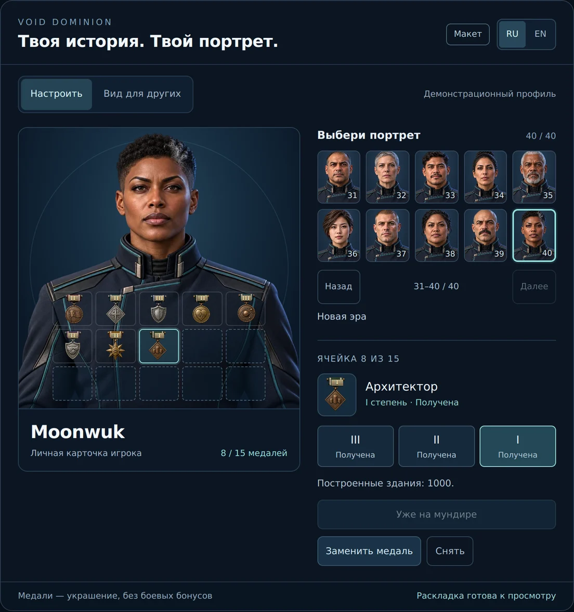
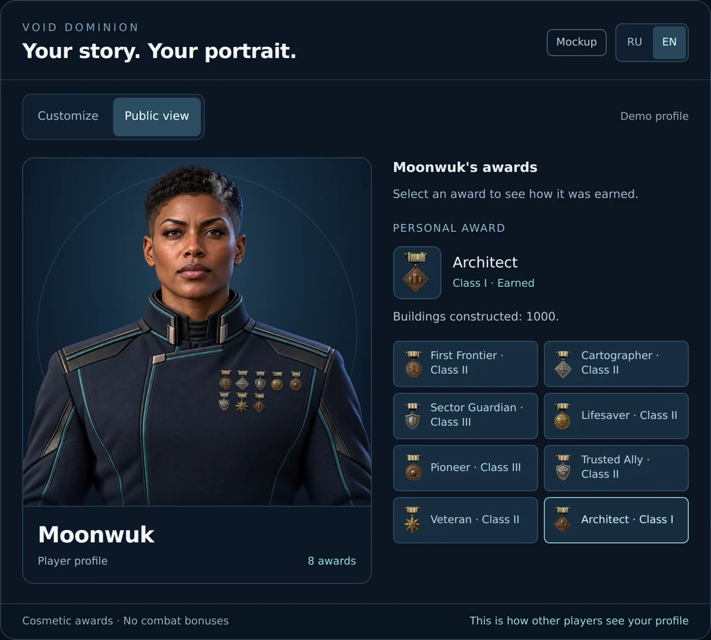

# Карточка игрока: портреты, медали и степени

Интерактивный дизайн-макет персонализации Void Dominion: 40 портретов, 15 мест
для медалей и три степени каждой награды. Подготовлен по запросу владельца
2026-09-27. Это материал для согласования интерфейса; профиль демонстрационный,
прогресс наград задан примерами, изменения действуют до перезагрузки страницы.

## Открыть макет

Откройте [index.html](./index.html) в браузере из локальной копии репозитория.
Папка `assets/` должна оставаться рядом. Сборка, сервер и внешние CDN не нужны.
GitHub показывает исходник HTML; для взаимодействия скачайте папку или репозиторий.

Начальный экран — «Вид для других». «Настроить» открывает выбор портрета и
плитку медалей. Переключатель RU / EN переводит интерфейс, названия, степени,
условия, сообщения и доступные имена элементов.

## Проверяемый сценарий

1. Выбрать один из 40 портретов на четырёх страницах по 10. Первые 10 сохранены
   из согласованного макета; портреты 11–40 — новые персонажи.
2. Нажать на одну из 15 ячеек: пять столбцов и три ряда. Выбрать заслуженную
   медаль. Пустые места разрешены; заполнять все 15 не требуется.
3. Открыть карточку медали: видны текущая степень и прогресс до следующей.
   При достижении порога новая степень автоматически заменяет предыдущую.
4. Перенести уже надетую медаль в пустое место или поменять местами с другой.
   Одна награда занимает одну ячейку независимо от степени; дубликатов нет.
5. Снять награду: она остаётся в коллекции с текущей высшей степенью.
6. Открыть «Ещё получить»: закрытая медаль показывает прогресс и не надевается.
7. Переключить портрет и язык: выбранные медали и места сохраняются.
8. Открыть «Вид для других». На мундире видны только награды: без рамок пустых
   ячеек, с масштабом, перспективой и тенями. Нажатие на медаль или её название
   раскрывает условие и степень. Клавиатура поддерживается нативными кнопками.

## Степени и предлагаемые условия

Порядок развития: **III → II → I**, где I — высшая степень. Получение следующей
степени автоматически обновляет единственную медаль и заменяет предыдущую степень;
выбирать или носить старую степень нельзя. Медаль остаётся в той же ячейке. Степень
обозначена римской цифрой на металлической планке ленты и явно подписана в карточке.
Медали косметические, боевых бонусов не дают.

Числа ниже — предложение для обсуждения, не действующие правила игры.
Порог считается накопительно по указанной метрике; сервер назначает наивысшую
достигнутую степень. В примере доступны восемь наград, четыре ещё закрыты.

| Награда | Метрика | III | II | I | Пример прогресса |
| --- | --- | ---: | ---: | ---: | ---: |
| Первый рубеж | Победы в матчах | 1 | 10 | 50 | 24 |
| Картограф | Разведанные секторы | 20 | 60 | 150 | 80 |
| Щит сектора | Оборонительные победы | 5 | 20 | 50 | 8 |
| Спасатель | Успешные спасательные миссии | 1 | 3 | 10 | 3 |
| Первопроходец | Основанные колонии | 1 | 5 | 20 | 2 |
| Надёжный союзник | Победы с союзниками | 5 | 20 | 50 | 22 |
| Ветеран | Завершённые матчи | 20 | 100 | 300 | 140 |
| Архитектор | Построенные здания | 50 | 250 | 1000 | 1500 |
| Гроза пиратов | Уничтоженные пиратские базы | 5 | 20 | 50 | 3 |
| Без потерь | Победы без потерь | 1 | 10 | 30 | 0 |
| Звезда командора | Победы в матчах | 100 | 250 | 500 | 24 |
| За горизонтом | Разведанные секторы | 100 | 250 | 500 | 80 |

## Арт

- `assets/portrait-01.webp` … `portrait-40.webp`: отдельные изображения с альфой.
  У первых десяти сохранены точные байты WebP из согласованного макета (640×640).
  Новые тридцать экспортированы в 768×768: разные лица, возраст и причёски,
  единый ракурс и свободная область мундира для наград.
- `assets/medals.webp`: прежний атлас 12 иллюстрированных наград, 4×3, 640×640.
  Сетка атласа независима от расположения ячеек 5×3 на мундире.
- `portraits.json`: каталог, русские и английские названия, характеристики файлов
  и полные промпты. Арт создан встроенным ImageGen; портреты 11–28 и 30–40 используют
  первый согласованный портрет только как референс стиля, формы и кадрирования.
  Портрет 29 создан по самостоятельному описанию того же художественного направления.

## Интеграция в основную игру

HTML остаётся автономным дизайн-макетом с демонстрационными RU/EN и прогрессом.
Основной клиент использует эти же неизменённые WebP через `prototype/src/profileArt.ts`,
а интерфейс — `profileScreen.ts`, `profileStudio.ts` и `prototype/profile.css`.
Весь игровой текст перенесён в ключи `localization/ru.ts` и `en.ts` общего рантайма.

Рабочий профиль хранит числовой индекс `portrait` и 15 позиций `medalId | null`.
`packages/server/src/profileApi.ts` проверяет владельца сессии и заработанные награды;
`profileStore.ts` сохраняет оформление и прогресс в памяти либо Postgres.
Степень вычисляется из серверного прогресса и автоматически заменяет предыдущую
на том же месте. Публичная карточка недоступна для редактирования.
В отличие от демонстрационных условий, реальные условия прямо называют доступные
факты итогового снапшота: контролируемые миры/здания, известные секторы, победы,
спасённых героев. Учёт начинается с подтверждённых завершений сетевых матчей;
демонстрационный прогресс не переносится в аккаунт. Детали — в [описании профиля](../../main-menu.md#42-профиль--статистика-игрока).
