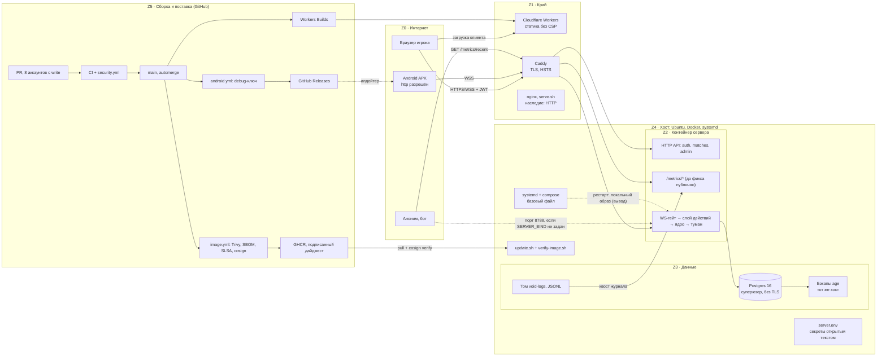

# Карта безопасности архитектуры — 2026-10-07

> Зоны доверия, защита в глубину и zero trust для Void Dominion, плюс список того, что
> реализовано, что нет и что сделано неправильно. Сверено с `main` на 2026-10-07: код
> сервера, слоя действий, клиента, прототипа, `deploy/`, `.github/workflows/`, права
> участников и ревью влитых PR через GitHub API. Утечка через `/metrics/recent` проверена
> запуском боевого бандла. Пометка «вывод» значит, что утверждение выведено из кода и на
> живой машине не воспроизводилось. Это датированный снапшот: номера строк могут
> сдвинуться. Он уточняет и местами поправляет
> [`defense-in-depth-2026-07-26.md`](defense-in-depth-2026-07-26.md) (см. §9).

**Итог.** Ядро и игровой протокол защищены сильно, сборка и подпись серверного образа
сделаны образцово. Слабые места лежат по краям: служебные эндпоинты, мобильная сборка,
хост и процесс ревью. Атака на дату снапшота пошла бы не через игровой протокол, а через
`/metrics/recent`, через APK или через аккаунт любого из восьми участников с правом write.

**Что чинить первым**

1. Закрыть `/metrics/*` снаружи (§6.1). Исправление — PR #1511.
2. Собирать APK релизным ключом из секретов, выключить cleartext (§6.2).
3. Владельцы зон и обязательное ревью для `deploy/`, `.github/`, `Dockerfile`, сервера
   и `prototype/netserver.ts` (ZTP-2.3 в `docs/zero-touch-prod/`), обязательная 2FA.
4. Привести systemd-юнит к релизному оверлею и закрыть порт 8788 в TLS-оверлее (§6.5,
   §6.8). Без этого автодеплой ZTP-1.2 может молча откатываться на неподписанную сборку.
5. Роль БД для приложения без суперпользователя (SE-3.1).

---

## 1. Важно про то, что работает в проде

`Dockerfile` запускает `packages/server/dist/proto-server.mjs`, то есть бандл
`prototype/netserver.ts`, а не `packages/server/src/main.ts`. Документы о защите до этой
даты описывали `main.ts`. Расхождения между двумя входами разобраны в §6.6.

## 2. Зоны доверия

| Зона | Что внутри | Кому доверяем | Чем закрыта | Где течёт |
| --- | --- | --- | --- | --- |
| Z0 Интернет | браузер, APK, анонимы, чужие сайты | никому | серверная авторитетность, туман войны, Origin allowlist | токены в `localStorage`, APK с публичным ключом |
| Z1 Край | Caddy, Cloudflare, GitHub Pages, наследие nginx | Caddy терминирует TLS | Let's Encrypt, HSTS, редирект на https | нет WAF и DDoS-защиты (SE-1.1), статика без заголовков |
| Z2 Сервер | Fastify + ws, слой действий, ядро | только проверенным токенам | 12 проверок на действие, CSP по хешам на своих страницах | `/metrics/*` (§6.1) |
| Z3 Данные | Postgres, журнал JSONL, бэкапы | серверу целиком | loopback, шифрование бэкапов age, учение восстановления в CI | суперпользователь, нет TLS и PITR, бэкапы на том же диске |
| Z4 Хост | Ubuntu, systemd, Docker, `server.env` | оператору целиком | distroless non-root, лимиты памяти и pids | группа docker, секреты открытым текстом, ручные входы |
| Z5 Сборка | GitHub, Actions, GHCR, Releases, Cloudflare Builds | 8 аккаунтам с write | SHA-пины, блокирующие сканеры, SBOM, SLSA, cosign | нет обязательного ревью, `android.yml` с лишними правами |
| Z6 Третьи стороны | Let's Encrypt, push-сервисы, api.github.com | по списку хостов | allowlist хостов push против SSRF | нет egress-контроля (SE-1.3) |

## 3. Путь одного действия игрока

Двенадцать проверок, каждая отказывает стабильным кодом и ничего не пропускает молча.

| # | Проверка | Где |
| --- | --- | --- |
| 1 | TLS и HSTS на Caddy | `deploy/Caddyfile` |
| 2 | Origin в списке (CSWSH) | `packages/server/src/wsServer.ts` |
| 3 | Join-токен: alg, typ, aud, 15 минут | `packages/server/src/auth.ts` |
| 4 | Билет места: sha256, сравнение за постоянное время | `wsServer.ts` |
| 5 | Поток: 32 КБ на сообщение, 50 сообщений в секунду | `wsServer.ts` |
| 6 | Конверт и zod-схема на тип | `packages/action-layer` |
| 7 | Права: `actionId` привязан к сессии сервера | `packages/action-layer/src/envelope.ts` |
| 8 | Квитанции и строгий `clientSeq` | `packages/action-layer` |
| 9 | 20 действий в секунду | `packages/server/src/matchRoom.ts:397` |
| 10 | Ядро: fail-secure, отказ кодом без деталей | `packages/shared-core` |
| 11 | Запись в БД до рассылки | `matchRoom.ts` |
| 12 | Туман войны на отправке | `matchRoom.ts`, SE-6.4 |

Боковой канал до фикса: наблюдения комнаты (`RoomObservation`, `matchRoom.ts:218`)
пишутся в JSONL до тумана (`prototype/netserver.ts`, `observe`) и отдавались наружу
через `/metrics/recent`.

## 4. Пути в прод

| Путь | Шаги | Оценка |
| --- | --- | --- |
| A. Подписанный образ | merge → `image.yml` (Trivy, smoke, SBOM, SLSA, cosign) → GHCR → `verify-image.sh` (личность `image.yml@refs/heads/main`) → `update.sh` с health и откатом | сделано хорошо, но запускает человек (ZTP-1.2) |
| B. Сборка на хосте | `moongame update` без `VOID_IMAGE` → `git pull` → `docker build` → `systemctl restart` | образ без скана и подписи (ZTP-2.1) |
| C. Рестарт или ребут | `moongame restart` → systemd поднимает базовый compose → пересоздаёт сервер из локального образа | подпись теряется (вывод, §6.5) |
| D. Клиент | merge → Workers Builds → статика без CSP и HSTS | автоматически, без одобрения |
| E. APK | merge → `android.yml` → debug-ключ из репо → Releases → апдейтер | любой может подписать «обновление» (§6.2) |

## 5. Защита в глубину и zero trust

| Слой | Состояние | Есть | Не хватает |
| --- | --- | --- | --- |
| Периметр и сеть | частично | TLS и HSTS, Postgres на loopback | WAF/DDoS (SE-1.1), сегментация сетей compose, порт 8788 закрывается вручную |
| Личность и сессии | частично | scrypt, одинаковый 401 с приманкой, JWT с закреплёнными alg/typ/aud, отзыв при сбросе пароля | ротация секрета (SE-2.2), refresh-rotation (MP-8), серверный logout, MFA админа |
| Транспорт | есть | Origin allowlist, точный CORS, лимиты размера и частоты | лимит соединений на IP (SE-6.1) |
| Гейт действий | сильно | конверт, схема, права, квитанции, `clientSeq`, 20/с | очередь игрока против double-spend (SE-6.3) |
| Игровая логика | сильно | детерминизм, fail-secure, MP-3, MP-4 | теневая пересимуляция (MP-2) |
| Выдача данных | дыра до фикса | туман на отправке (SE-6.4) | `/metrics/recent` обходил туман |
| Данные в покое | частично | бэкапы age, учение восстановления | SE-3.1, SE-3.2, SE-3.3, PITR и копия вне хоста (SE-3.4) |
| Хост | частично | distroless, non-root, лимиты, образы по дайджесту | секрет-стор (SE-2.1), хост как код (ZTP-4.1), break-glass (ZTP-4.3) |
| Цепочка поставки | сильно | SHA-пины, блокирующие сканеры, SBOM, SLSA, keyless cosign, pull-модель | обязательное ревью, `android.yml` |
| Клиент | частично | CSP по хешам на страницах сервера | заголовки статики, Trusted Types (MP-5), Semgrep на `innerHTML` в `prototype/` |
| Обнаружение | нет | агрегатор метрик в памяти, `/health` | SE-8.1–8.3, SE-9.2 |

| Связь | Zero trust | Почему |
| --- | --- | --- |
| Игрок → сервер | да | проверка на соединении и на каждом сообщении (SE-0.2) |
| Чужой сайт → WebSocket | да | Origin allowlist до апгрейда |
| CI → прод | да | pull-модель, подпись с закреплённой личностью; единственный секрет репо `NVD_API_KEY` |
| Caddy → сервер | доверие по сети | `X-Forwarded-*` верятся от любого, кто дошёл до 8788 (вывод) |
| Разработчик → main | нет | любой из 8 аккаунтов плюс зелёный CI равно код у игроков |
| Сервер → БД | нет | один суперпользователь, без TLS и RLS |
| Оператор → хост | нет | постоянный ручной доступ, группа docker, секреты открытым текстом |
| Телефон → обновление APK | нет | ключ подписи лежит в публичном репо |
| Сервис → сервис | нет идентичностей | SE-0.3; пока сервис один, терпимо |

## 6. Что сделано неправильно

### 6.1 Публичный `/metrics/recent` выдавал то, что скрывает туман — высокая, проверено запуском

`prototype/netserver.ts` регистрировал `/metrics/summary`, `/metrics/health`,
`/metrics/recent` без проверки сессии при любом режиме, Caddy проксировал все пути.
Запуск бандла с `AUTH_JWT_SECRET`, `GATE=1`, `SEAT_LOCK=1`: ответ 200 без токена. За 35
секунд партии с ботами из 200 последних строк было 131 событие, 62 действия и 6
экономических срезов: `fleet.departed` с `from`, `to` и `path` любого флота, казна и
доход всех десяти игроков, `hero.revealed`, кто кому объявил войну. Каждый запрос
синхронно читал весь растущий файл журнала. **Исправление:** маршруты отвечают только
прямому loopback-пиру или `Authorization: Bearer $METRICS_TOKEN`
(`packages/server/src/operatorAccess.ts`), Caddy отвечает 404 на `/metrics/*`.

### 6.2 APK подписан debug-ключом из публичного репо — высокая

`android.yml` собирает `assembleDebug` и подписывает `mobile/debug.keystore` (пароль
`android`); репозиторий публичный. `mobile/capacitor.config.json`: `androidScheme: "http"`,
`cleartext: true`. `VoidNative.open(url)` (`mobile/patch-updater.mjs`) открывает любой
адрес. Любой может собрать APK, который Android примет как обновление. Debug-сборка
отлаживаемая (вывод: поведение Android по умолчанию). Чинить: релизный ключ в секретах
или Play App Signing, `assembleRelease`, https-схема, allowlist моста. Смена ключа
требует переустановки у текущих игроков.

### 6.3 Обязательного ревью на деле нет — высокая

`.github/CODEOWNERS` закомментирован, write у 8 аккаунтов, PR #1506, #1501, #1494,
#1497 влиты без ревью, хотя `CONTRIBUTING.md` обещает минимум одно. Merge сам выкатывает
клиент и публикует подписанный образ: подпись доказывает «собрано нашим CI», а не
«проверено человеком». Настройки ruleset не видны, поэтому неизвестно, выключено правило
или его обходят. Чинить: ZTP-2.3 и обязательная 2FA.

### 6.4 Установка по умолчанию открывает голый HTTP — высокая

`deploy/install-ubuntu.sh` ставит `PROD=0`, `ALLOWED_ORIGINS=http://…`, советует проброс
порта; systemd поднимает базовый compose на `0.0.0.0:8788`. Наследие `serve.sh` и nginx
работают по HTTP, лог `combined` пишет `?token=` и `?ticket=`. В доках `deploy/` записан
публичный адрес домашнего сервера и адрес в локальной сети. Чинить: TLS-оверлей и
`PROD=1` по умолчанию, убрать наследие, убрать адреса (в истории git они останутся).

### 6.5 Рестарт через systemd может заменить подписанный образ — средняя, вывод

`update.sh` поднимает `-f docker-compose.yml -f docker-compose.release.yml up -d
--no-build`, а юнит (`install-ubuntu.sh`, `ExecStart`) — `docker compose up
--remove-orphans` только с базовым файлом, где у сервера `build:` без `image:`.
`moongame restart` = `systemctl restart`. После рестарта compose видит другой конфиг и
пересоздаёт сервер из локального образа. На машине с Docker не воспроизводилось. Нужно до
ZTP-1.2: юнит должен поднимать тот же набор файлов с дайджестом из `.last-good-image`.

### 6.6 Два входа сервера с разными защитами — средняя

Только в `main.ts`: внешний `@fastify/rate-limit` 100/мин на `/auth/*`. Только в
прототипе: `/metrics/*`, `singlePeerPerPlayer`. Проверка `PROD` в прототипе скопирована,
а не импортирована. Шапка `Dockerfile` называет образ «in-memory, unauthenticated, not
for prod», это устарело. В `main.ts` комната поднимается до проверки токена и не уходит в
гибернацию после отказа (вывод, тестом не проверялось). Чинить: один хост или тест
паритета защит.

### 6.7 Приложение ходит в Postgres суперпользователем и без TLS — средняя

`DATABASE_URL` с пользователем `void`, который в официальном образе суперпользователь;
миграции выполняет само приложение (`persistence.ts`). Сети compose не разделены (вывод).
SQL-инъекция или RCE в сервере дают всю БД и выполнение команд через `COPY … PROGRAM`.
Чинить: SE-3.1, затем SE-3.2.

### 6.8 TLS-оверлей сам не закрывает порт 8788 — средняя

База публикует `${SERVER_BIND:-0.0.0.0}:8788`, `docker-compose.tls.yml` включает
`TRUST_PROXY=1`, но порт не переопределяет. Забытый `SERVER_BIND=127.0.0.1` открывает
сервер напрямую, а с `TRUST_PROXY=1` он верит поддельному `X-Forwarded-For` (вывод).
Опубликованные Docker-порты обходят UFW (поведение Docker, на хосте не проверялось).

### 6.9 Токены: один секрет, неделя жизни, `localStorage` — средняя

Join, сессию и сброс подписывает один HS256-секрет без `kid` и ротации. Сессия 7 дней в
`localStorage` вместе с билетами мест, выход только локальный, у админа нет второго
фактора. Любой XSS в прототипе превращается в угон аккаунта на неделю.

### 6.10 Статика клиента без заголовков — средняя

Нет `_headers` для Cloudflare, Pages их не задаёт. CSP по хешам только на страницах
сервера. Правило `.semgrep/rules/no-innerhtml-assignment.yaml` смотрит только в
`packages/`, а в `prototype/src` 99 присваиваний `innerHTML`. Trusted Types нет (MP-5).

### 6.11 `android.yml` выбивается из уровня остальных workflow — средняя

`contents: write` и `id-token: write` на весь workflow, триггер на случайную ветку
`claude/awesome-bohr-ygnunp`, `npm ci` с lifecycle-скриптами рядом с токеном на запись,
`cosign sign-blob` с `continue-on-error: true`, проверка принимает любой workflow
репозитория. Образец — `image.yml`.

### 6.12 Низкая серьёзность

- Регистрация отвечает 409 `E_EMAIL_TAKEN` (`authApi.ts`), логин — одинаковым 401;
  анти-автоматизации нет (MP-6).
- Создать партию может любая сессия, квоты нет, потолок 64 на процесс, список не
  уменьшается до рестарта (`netserver.ts`, `MAX_HOSTED`; вывод).
- Нет лимита WS-соединений на IP (SE-6.1), центральных логов и алертов (SE-8), PITR и
  копии бэкапов вне хоста (SE-3.4). Dependabot не видит Dockerfile Caddy и пины compose.

## 7. Что реализовано

- **Игра и протокол:** серверная авторитетность; туман на отправке и фильтр событий
  (SE-6.4); гейт действий; `actionId` привязан к сессии сервера; fail-secure ядро;
  детерминизм, реплей и хеш состояния; MP-3, MP-4; запись до рассылки.
- **Вход:** scrypt; одинаковый 401 с приманкой; JWT с закреплёнными alg/typ/aud; отзыв
  сессий при сбросе пароля; лимиты по IP; билеты мест по хешу; admin по именованным
  аккаунтам; выключатель `PROD=1` (MP-1).
- **Веб:** Origin allowlist, точный CORS, CSP по хешам на страницах сервера, HSTS на
  Caddy, лимиты размера и частоты, allowlist хостов push.
- **Поставка:** SHA-пины actions и дайджест-пины образов; блокирующие Trivy, Semgrep,
  Gitleaks, OSV (состав — в [`pipeline.md`](pipeline.md)); SBOM, SLSA, keyless cosign;
  `verify-image.sh` с закреплённой личностью; pull-модель; distroless non-root; бэкапы
  age с учением восстановления в CI.

## 8. Что не реализовано

Сеть и секреты: SE-0.3, SE-1.1, SE-1.2, SE-1.3, SE-2.1, SE-2.2. Данные: SE-3.1, SE-3.2,
SE-3.3, SE-3.4 (PITR и копия вне хоста), MP-7. Сервер и клиент: SE-6.1, SE-6.3, SE-7.1
(Trusted Types), SE-7.2, MP-2, MP-5, MP-6, MP-8. Эксплуатация: SE-8.1–8.3, SE-9.1,
SE-9.2, ZTP-1.1, ZTP-1.2, ZTP-2.1, ZTP-2.3, ZTP-4.1, ZTP-4.3. Источники:
[`secure-environment-roadmap.md`](../secure-environment-roadmap.md),
[`security-master-plan.md`](security-master-plan.md), `docs/zero-touch-prod/`.

## 9. Где документы разошлись с кодом

- `defense-in-depth-2026-07-26.md`: лимит на `/auth` назван двухслойным, но внешний слой
  есть только в `main.ts`; «бэкапы не построены» устарело (`deploy/backup.sh`, учение в
  CI); «одно соединение на игрока» включено только в прототипе.
- `CONTRIBUTING.md` обещает минимум одно ревью, PR вливаются без ревью.
- SE-6.2 «Rate-limiting действий» отмечен ⏳, а лимит 20/с уже в `matchRoom.ts:397`.
- Шапка `Dockerfile` и объяснение отсутствия `read_only` в `docker-compose.yml` устарели.
